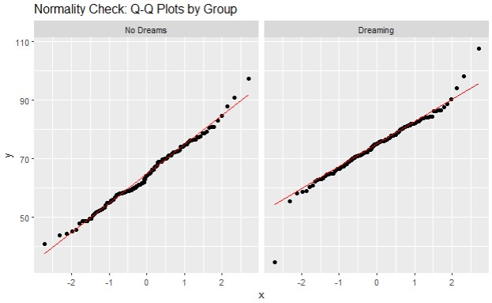
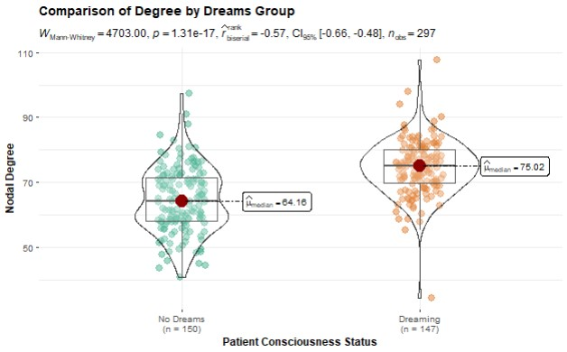
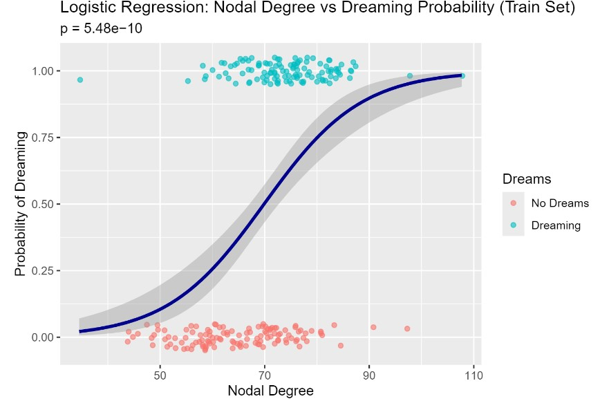
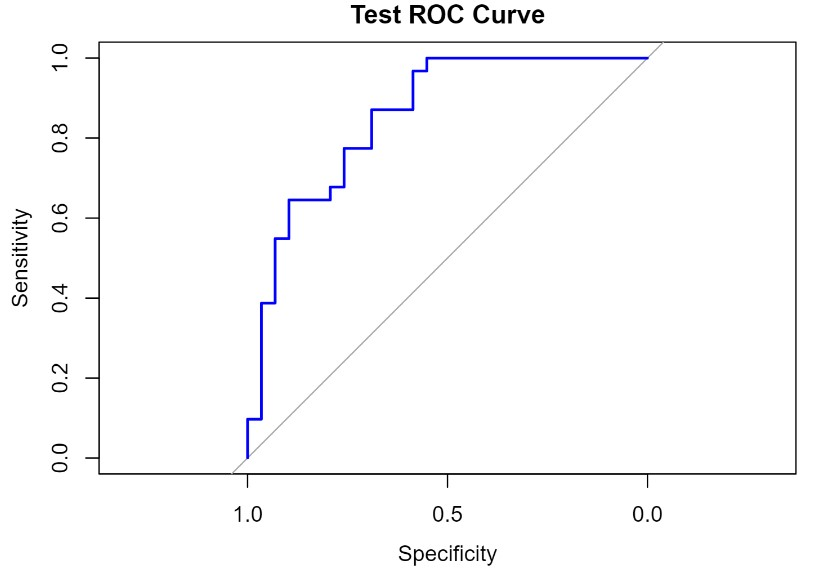

# University of Chicago Mini-Experiment
hi
[Small, 2-page Supplement](https://github.com/stevehaworth02/uchicago/blob/main/SupplementPDF/CodeSupplement_NoStatisticalTest.pdf)

[7-page FULL Workflow (Data Wrangle, Stats, ML, and more)](https://github.com/stevehaworth02/uchicago/blob/main/SupplementPDF/SupplementSubmission_FULL.pdf)

Hello University of Chicago MS-ADS Committee, thank you for visiting my GitHub page for my mini-experiment.

I LOVE the embedded boxplot/violin plot that I made for my coding supplement because the plot created is SO statistically rich.

However, in order for the statistics to be meaningful we must carefully pick the arguments of ggbetweenstats() based on the assumptions of our data.

In this repository, I expand my workflow beyond just wrangling and visualizing, I justify the arguments I set in my coding supplement via statistical tests and do some machine learning, I hope you enjoy inspecting my code as much as I loved writing it.

## For sake of your time, I've put all figures below, for the full statistical work-flow: click the hyper-links on top for pdf summaries. There are RMD's available as well if you want to reproduce my results

Here is the photo summary of my work, find the full code in the SupplementSubmission_FULL.pdf

